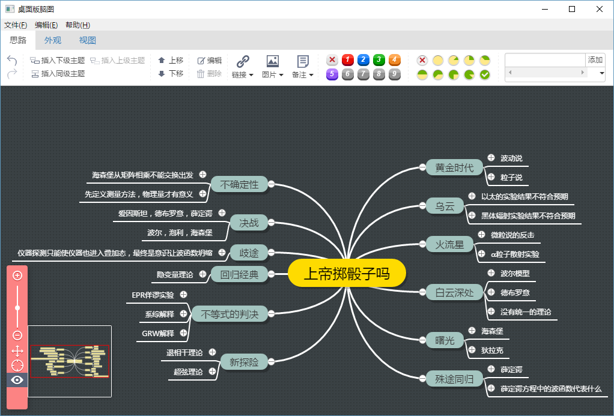

# DesktopNaotu

## 简介

桌面版脑图是基于百度脑图的本地化版本，帮助你在没有互联网环境的情况下，依然可以使用脑图工具。

## 功能
- 包含百度脑图的基本功能
- 本地km文件的操作
- [提供百度脑图文件的下载脚本](doc/Help.md)

## 下载
[桌面版脑图](http://pan.baidu.com/s/1jHNBL7C)
- Windows 32位
- Windows 64位
- Mac OSX 64位
- Linux 64位

## 截图

## 联系我们
问题和建议反馈：

- [Github issues](https://github.com/topcss/DesktopNaotu/issues)
- [加入讨论组](https://gitter.im/DesktopNaotu/DesktopNaotu)

## License
Code released under the [MIT license](LICENSE).

