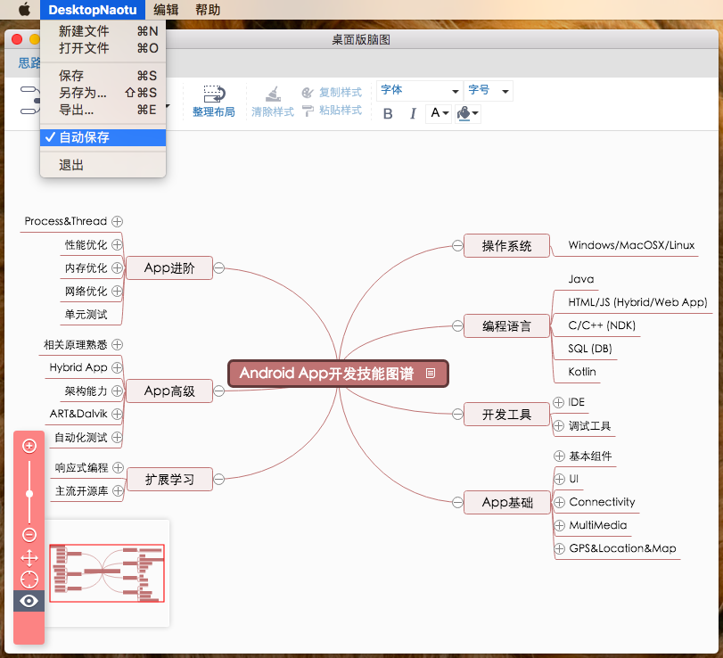
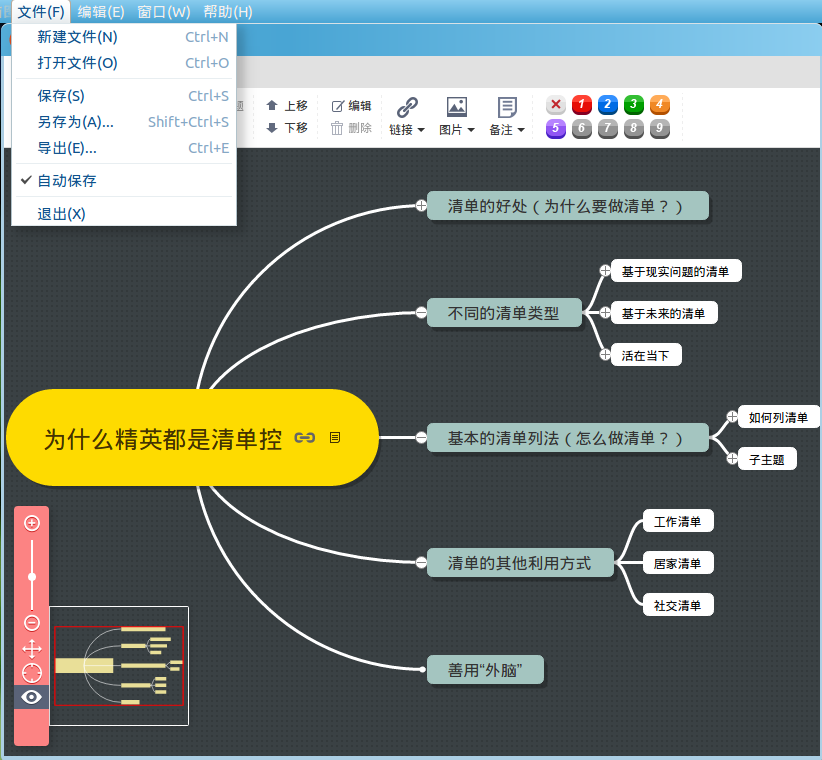
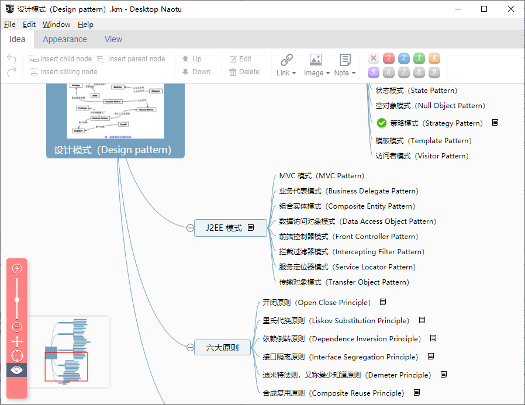

# 桌面版脑图(DesktopNaotu) [](https://gitter.im/DesktopNaotu/DesktopNaotu) [](https://shang.qq.com/wpa/qunwpa?idkey=cbd6fbc32adbe20c99c005bc559ec45bf3c9bfe581f9226ed14bd0951ae95739)

## 1、中文介绍

### 软件介绍 [--> **English introduction**](README.md)

桌面版脑图是基于百度脑图的本地化版本，帮助你在没有互联网环境的情况下，依然可以使用脑图工具。

### 如何下载

- 方法1：通过 [**百度云下载**](http://pan.baidu.com/s/1jHNBL7C)
- 方法2：通过 [**Github 的 Releases 下载**](https://github.com/NaoTu/DesktopNaotu/releases)

### 各版本对应的系统

| 操作系统  | 位数    |  对应文件 |  大小  | 支持情况 |
| --------  | -----: | -----: | :----  | -- |
| MacOS | 64位 | DesktopNaotu-macOS-x64 | < 50M | 支持全部功能 |
| Linux | 64位 | DesktopNaotu-linux-x64 | < 50M | 支持全部功能 |
| Windows 7/10 | 64位 | DesktopNaotu-win32-x64 | < 50M | 支持全部功能 |
| Windows 7/10 | 32位 | DesktopNaotu-win32-ia32 | < 50M | 支持全部功能 |
| Windows XP  | 32位 | DesktopNaotu-Windows-mini | < 8M | 不支持调试 |

### 功能特征

- 包含百度脑图的基本功能
- 本地km文件的操作
- 支持拖拽打开km文件
- 支持关联打开km文件
- 支持自动保存功能
- [提供 **百度脑图** 文件的下载方式](Help.md)
- [提供 **ProcessOn** 思维导图的下载方式](Help.md)
- [查看历史版本](History.md)

### 软件截图

- Windows 截图


- Mac OS X 截图



- Linux 截图



### 如何编译

#### 1. 安装所有依赖

```bash
# 安装必备工具
npm install -g gulp
npm install -g bower

# 自动安装依赖
npm install
bower install
```

#### 2. 更换graceful-fs版本（对于Node `v10.x`及以上版本）

```bash
npm install graceful-fs

# 如果仍出现"ReferenceError: primordials is not defined" 的错误，
# 则删掉cnpm安装的旧版本
rm -rf node_modules/_graceful-fs@3.0.12@graceful-fs

# 如果某个子模块依赖旧版本graceful-fs，则请根据报错信息，
# 切换到该模块目录下更新。
cd node_modules/<PATH_TO_MODULE_USING_DEPRECATED_GRACEFUL_FS>
npm install graceful-fs@4.x
```

#### 3. 更换`@types/node`版本

```bash
npm install @types/node@12.x
```

#### 4. 开始编译

```bash
gulp
```

#### 5. 测试运行

```bash
npm run demo
```

### 联系我们

问题和建议反馈：

- [Github issues](https://github.com/NaoTu/DesktopNaotu/issues)
- [加入讨论组](https://gitter.im/DesktopNaotu/DesktopNaotu)
- QQ群：330722928

### 捐赠项目

感谢您的慷慨捐赠。


Code released under the [GPL-2.0 License](LICENSE).

## 2、英文介绍

### Software introduction [--> **中文介绍**](doc/README-zh.md)

The desktop version of Mind Mapping is a localized version of Baidu Mind Mapping, which helps you to use Mind Mapping Tool without Internet.

### Special Sponsors

<p align="center"><a href="https://documentnode.io/?utm_source=github&utm_medium=sponsor&utm_campaign=desktopnaotu" target="_blank" rel="noopener noreferrer"></a><br>
Open Document Node, Inspiration Unfold</p>

### How to download

- Method 1：Download through [**Baidu Cloud**](http://pan.baidu.com/s/1jHNBL7C)
- Method 2：Download through [**Github's Releases**](https://github.com/NaoTu/DesktopNaotu/releases)

### System corresponding to each version

| Operating System | Bit | Corresponding File | Size | Support |
| --------  | -----: | -----: | :----  | -- |
| MacOS | 64 bit | DesktopNaotu - macOS - x64 | < 50M | Supports all functions |
| Linux | 64 bit | DesktopNaotu-linux-x64 | < 50M | Supports all functions |
| Windows 7/10 | 64 bit | DesktopNaotu-win32-x64 | < 50M | Supports all functions |
| Windows 7/10 | 32 bits | DesktopNaotu-win32-ia32 | < 50M | Supports all functions |
| Windows XP | 32 bits | DesktopNaotu-Windows-mini | < 8M | Debugging is not supported |

### Functional characteristics

- Basic functions of Baidu Mind Mapping
- Operation of local km files
- Support dragging open km files
- Support association to open km files
- Support for automatic saving
- [Provide **Baidu Mind Mapping** File Download Method](doc/Help.md)
- [Provide **ProcessOn** Mind Map Download Method](doc/Help.md)
- [View Historical Version](doc/History.md)

### Software screenshots

- Windows screenshot



- Mac OS X screenshot


- Linux screenshot


### How to compile

#### 1. Install dependencies

```bash
# Install prerequisites
npm install -g gulp
npm install -g bower

# Install dependencies
npm install
bower install
```

#### 2. Change graceful-fs version (For Node `v10.x` or newer)

```bash
npm install graceful-fs

# If error "ReferenceError: primordials is not defined" still occurs, remove the old edition installed by cnpm
rm -rf node_modules/_graceful-fs@3.0.12@graceful-fs

# If a submodule relies on old graceful-fs, please follow the log, locate to its directory, 
# then manually update
cd node_modules/<PATH_TO_MODULE_USING_DEPRECATED_GRACEFUL_FS>
npm install graceful-fs@4.x
```

#### 3. Change `@types/node` to v12.x

```bash
npm install @types/node@12.x
```

#### 4. Build

```bash
gulp
```

#### 5. Try running

```bash
npm run demo
```

### Contact us

Questions and suggestion feedback:

- [Github issues](https://github.com/NaoTu/DesktopNaotu/issues)
- [Join the discussion group](https://gitter.im/DesktopNaotu/DesktopNaotu)
- QQ group：330722928

### License

Code released under the [GPL-2.0 License](LICENSE).
